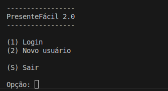
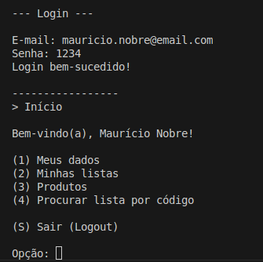
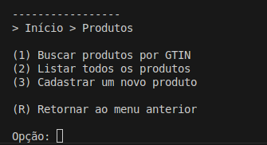
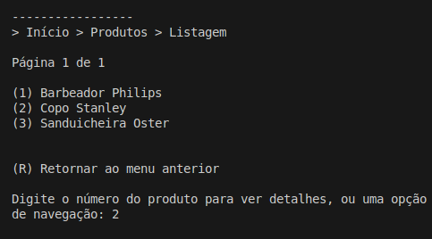
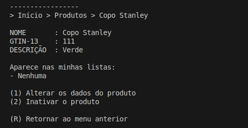
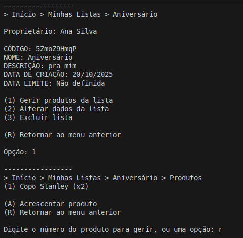

## 🎁 PresenteFácil 1.0 🎁

_Algoritimos e Estrutura de Dados III — Trabalho Prático 01_

---

### 📝 Descrição do Projeto

O **PresenteFácil**  é um sistema de linha de comando desenvolvido para simplificar a vida de quem quer centralizar seus desejos e compartilhá-los com amigos e familiares de uma maneira organizada. A aplicação permite que usuários se cadastem, criem múltiplas listas para diferentes ocasiões (como aniversários e casamentos) e as compartilhem com amigos e familiares através de um código único, facilitando a troca de presentes e evitando duplicatas.

O projeto foi construído em Java, utilizando um sistema de persistência de dados baseado em ficheiros de acesso direto. A eficiência das buscas e dos relacionamentos é garantida pela implementação de estruturas de dados avançadas, como Tabela Hash e Árvore B+, que atuam como índices secundários para as entidades Usuario e Lista.

---

### 🧑‍💻 Equipe do Projeto

* Ana Clara Lonczynski
* Bruno Menezes Rodrigues Oliveira Vaz
* João Costa Calazans
* Letícia Azevedo Cota Barbosa 
* Miguel Pessoa Lima Ferreira

---
### 🎥 Vídeos de Demonstração:

TP1 - Cadastro de Usuários e Gestão de Listas: [Assista aqui](https://youtu.be/IlUBODiJDhQ)

TP2 - Gestão de Produtos e Associações N:N: [Assista aqui]([https://youtu.be/](https://youtu.be/zhZKEX3NzhI))

---

### 🚀 Evolução das Funcionalidades
O segundo trabalho prático expandiu o sistema para incluir a gestão de produtos e a sua associação às listas de presentes, introduzindo um relacionamento N:N (Lista <-> Produto). As principais funcionalidades adicionadas são: 

#### Contexto do TP1: Usuários e Listas

No primeiro trabalho prático, o foco foi na implementação das entidades Usuario e Lista, estabelecendo o relacionamento 1:N (um usuário pode ter várias listas). As funcionalidades principais incluíam:

* Autenticação e Gestão de Utilizadores: Cadastro de novos utilizadores, login via e-mail e senha (armazenada em hash SHA-256), e gestão de dados pessoais (alterar/excluir conta).

* Criação e CRUD de Listas de Presentes: Utilizadores podem criar, ler, atualizar e excluir múltiplas listas, cada uma com nome, descrição e data limite opcional.

* Compartilhamento de Listas: Cada lista gera um código alfanumérico único, permitindo a visualização por outros utilizadores.

* Interface de Linha de Comando: Navegação intuitiva com menus textuais e "breadcrumbs".

#### CRUD Completo de Produtos:

* Cadastro: Inclusão de novos produtos com GTIN-13 (tratado como String), Nome e Descrição. É garantida a unicidade do GTIN.

* Busca: Procura de produtos por GTIN-13.

* Listagem Paginada: Exibição de todos os produtos cadastrados (ativos ou inativos), ordenados por nome, com paginação de 10 elementos por página.

* Inativação/Reativação: Produtos podem ser inativados (soft delete), permanecendo na base de dados, mas não visíveis para novas associações. Um produto não pode ser inativado se estiver associado a alguma lista.

#### Relacionamento N:N (Lista <-> Produto):

* Implementado através de uma entidade de associação ListaProduto, que guarda ID Lista, ID Produto, Quantidade e Observações.

* Utiliza duas Árvores B+ como índices: uma para (idLista; idListaProduto) e outra para (idProduto; idListaProduto), permitindo consultas eficientes de ambos os lados do relacionamento.

#### Gestão de Produtos em Listas:

* Adicionar Produtos: Dentro de uma lista, é possível adicionar produtos existentes buscando por GTIN-13.

* Alterar/Remover Associações: É possível alterar a quantidade e as observações de um produto específico dentro de uma lista, ou removê-lo completamente.

#### Consultas Cruzadas:

* Na tela de detalhes de um produto, o sistema exibe em quais listas pessoais (do utilizador logado) ele aparece e a quantidade de listas de outros utilizadores em que o produto também está.

#### Integridade Referencial:

* Ao excluir uma lista, todas as suas associações (ListaProduto) são automaticamente excluídas (exclusão em cascata).

* Um produto não pode ser inativado se ainda estiver associado a qualquer lista.

---

### 📸 Principais Telas

Abaixo estão as principais telas do sistema.

* Tela de Login de Usuário:

* Menu Principal:

* Menu de Produtos:

* Listagem Paginada de Produtos:

* Detalhes do Produto:

* Gerenciar Produtos na Lista:

---
### ⚙️ Arquitetura e Principais Classes 

O sistema foi desenvolvido seguindo o padrão MVC (Model-View-Controller) para separar as responsabilidades de dados, interface e lógica de controlo, por meio de diversas classes, as principais são:

* Usuario: Representa a entidade "Utilizador". Armazena os dados pessoais e implementa a interface Entidade para ser compatível com o sistema de ficheiros. A senha é guardada de forma segura através de um hash SHA-256, e não em texto plano.

* CRUDUsuario: Estende a classe genérica Arquivo e gere a persistência da entidade Usuario. Mantém um índice secundário HashExtensivel para o e-mail, otimizando o processo de login e evitando duplicados.

* Lista: Representa a entidade "Lista de Presentes". Implementa Entidade para serialização e Comparable para permitir a ordenação alfabética das listas.

* CRUDLista: Estende Arquivo e gere a persistência da entidade Lista. No TP1, implementou o relacionamento 1:N através de uma ArvoreBMais que liga idUsuario a idLista.

* Produto: A nova entidade que representa um "Produto", com atributos como GTIN, nome, descrição e um estado de ativo.

* CRUDProduto: Estende Arquivo e gere a persistência da entidade Produto. Mantém um índice secundário HashExtensivel para o GTIN, permitindo buscas rápidas. Implementa a lógica de "soft delete" (inativação/reativação).

* ListaProduto: A entidade de associação que representa o relacionamento N:N entre Lista e Produto. Armazena chaves estrangeiras (idLista, idProduto), quantidade e observações.

* CRUDListaProduto: Estende Arquivo e gere a persistência da entidade ListaProduto. É o coração do relacionamento N:N, mantendo duas ArvoreBMais para permitir buscas eficientes em ambas as direções (Lista -> Produtos e Produto -> Listas).

* ControlePrincipal: É o ponto de entrada e o orquestrador geral da aplicação. Gere o estado da sessão (login/logout) e delega as tarefas para os controladores específicos.

* ControleUsuario: Contém a lógica de negócio para autenticação, cadastro e gestão do perfil do utilizador.

* ControleLista: Gere a lógica de negócio das listas. No TP2, foi expandido para incluir a gestão de produtos dentro de uma lista (adicionar, alterar quantidade/observações, remover).

* ControleProduto: O novo controlador que gere toda a lógica de negócio da secção global de "Produtos", incluindo a listagem paginada, o cadastro e as consultas cruzadas.

* Arquivo: A classe genérica fornecida que implementa o CRUD de base para qualquer entidade, incluindo a gestão de espaços livres (reutilização de registos apagados).

* ArvoreBMais: A estrutura de dados fornecida, usada para implementar os índices de relacionamento 1:N (Usuario -> Lista) e N:N (Lista <-> Produto).

* HashExtensivel: A estrutura de dados fornecida, usada para implementar os índices de acesso direto por chave, como o e-mail do utilizador, o código da lista e o GTIN do produto.

### ✅ Checklist

|Requisito|Status|
|---------|------|
|Há um CRUD de usuários (que estende a classe ArquivoIndexado, acrescentando Tabelas Hash Extensíveis e Árvores B+ como índices diretos e indiretos conforme necessidade) que funciona corretamente?|[✅]|
|Há um CRUD de listas (que estende a classe ArquivoIndexado, acrescentando Tabelas Hash Extensíveis e Árvores B+ como índices diretos e indiretos conforme necessidade) que funciona corretamente?|[✅]|
|As listas de presentes estão vinculadas aos usuários usando o idUsuario como chave estrangeira?|[✅]|
|Há uma árvore B+ que registre o relacionamento 1:N entre usuários e listas?|[✅]|
|Há um CRUD de usuários (que estende a classe ArquivoIndexado, acrescentando Tabelas Hash Extensíveis e Árvores B+ como índices diretos e indiretos conforme necessidade)?|[✅]|
|Há uma visualização das listas de outras pessoas por meio de um código NanoID?|[✅]|
|CRUD de produtos funcional, com CRUDProduto usando HashExtensivel como índice de GTIN e incluindo lógica de inativação (soft delete).|[✅]|
|CRUD da entidade de associação ListaProduto funcional, utilizando duas ArvoreBMais para indexar o relacionamento N:N e permitir buscas eficientes.|[✅]|
|Visão de produtos implementada, com consulta cruzada que exibe as listas pessoais onde um produto aparece e a contagem de listas de outros.|[✅]|
|Visão de listas expandida, permitindo a gestão completa de produtos dentro de uma lista (adicionar, alterar e remover).|[✅]|
|Integridade do relacionamento N:N mantida, com regras que impedem a inativação de produtos em uso e garantem a exclusão em cascata.|[✅]|
|O trabalho compila corretamente?|[✅]|
|O trabalho está completo e funcionando sem erros de execução?|[✅]|
|O trabalho é original e não a cópia de um trabalho de outro grupo?|[✅]|
