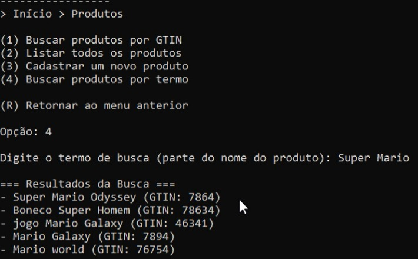
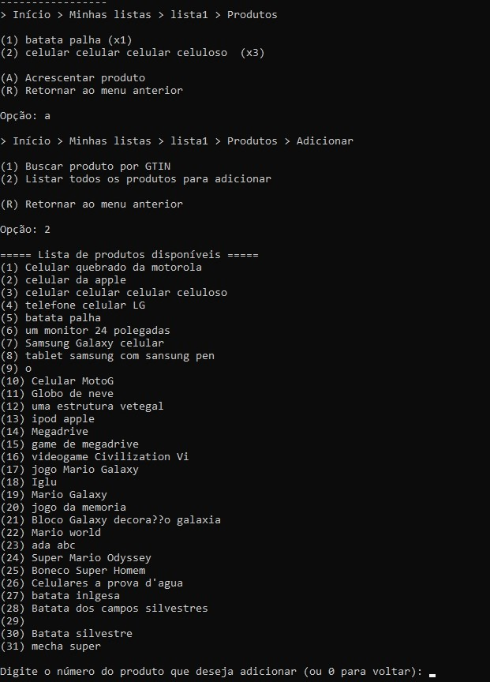

## 🎁 PresenteFácil 3.0 🎁

_Algoritimos e Estrutura de Dados III — Trabalho Prático_

---

### 📝 Descrição do Projeto

O **PresenteFácil**  é um sistema de linha de comando desenvolvido para simplificar a vida de quem quer centralizar seus desejos e compartilhá-los com amigos e familiares de uma maneira organizada. A aplicação permite que usuários se cadastem, criem múltiplas listas para diferentes ocasiões (como aniversários e casamentos) e as compartilhem com amigos e familiares através de um código único, facilitando a troca de presentes e evitando duplicatas.

O projeto foi construído em Java, utilizando um sistema de persistência de dados baseado em ficheiros de acesso direto. A eficiência das buscas e dos relacionamentos é garantida pela implementação de estruturas de dados avançadas, como Tabela Hash e Árvore B+, que atuam como índices secundários para as entidades Usuario e Lista.

Nesta versão, foi implementado um **Índice Invertido** para permitir buscas eficientes de produtos por palavras (termos) presentes nos nomes dos produtos. O sistema utiliza a técnica TFxIDF (Term Frequency — Inverse Document Frequency) para ordenar os resultados por relevância, proporcionando uma experiência de busca similar a motores de busca modernos.

---

### 🧑‍💻 Equipe do Projeto

* Ana Clara Lonczynski
* Bruno Menezes Rodrigues Oliveira Vaz
* João Costa Calazans
* Letícia Azevedo Cota Barbosa 
* Miguel Pessoa Lima Ferreira

---
### 🎥 Vídeos de Demonstração:

[VideoTP3](https://youtu.be/xhuX0qRfM-8)

---

### 🚀 Funcionalidades Principais

* **Autenticação e Gestão de Usuários**: O sistema possui um fluxo completo de autenticação, permitindo o cadastro de novos utilizadores e o login via e-mail e senha (armazenada em formato de hash para segurança). O acesso é feito via e-mail e senha. O utilizador autenticado pode visualizar, alterar ou excluir os seus próprios dados, além de poder recuperar sua senha por meio de pergunta e resposta secretas.

* **Criação de Listas de Presentes**: Um usuário pode criar múltiplas listas, cada uma com um nome, descrição e, opcionalmente, uma data limite. Cada lista é vinculada a um único usuário.

* **CRUD Completo de Listas**: Um utilizador autenticado pode criar, ler, atualizar e excluir múltiplas listas de presentes. Cada lista é vinculada unicamente ao seu criador, estabelecendo um relacionamento 1-N. A navegação é intuitiva, utilizando menus textuais e um "rastro" (breadcrumb) para indicar a localização do usuário no sistema.
  
* **Visualização e Compartilhamento**: Para cada lista criada, o sistema gera automaticamente um código compartilhável único, alfanumérico de 10 caracteres (semelhante ao NanoID). Esse código permite que o criador da lista a compartilhe com outras pessoas, que poderão visualizar o conteúdo.

* **Gestão de Produtos**: O sistema permite cadastrar, listar, alterar e inativar produtos. Cada produto possui um nome, descrição e GTIN-13 (código de barras).

* **Busca de Produtos por GTIN-13**: É possível buscar produtos diretamente pelo seu código GTIN-13 através de um índice secundário implementado com Hash Extensível.

* **Busca de Produtos por Palavras (Índice Invertido)**: O sistema implementa um índice invertido que permite buscar produtos por palavras presentes nos nomes dos produtos. A busca utiliza a técnica TFxIDF para ordenar os resultados por relevância:
  - **TF (Term Frequency)**: Frequência do termo no nome do produto
  - **IDF (Inverse Document Frequency)**: Inverso da frequência do termo entre todos os produtos, calculado como log(N/df) + 1
  - Os resultados são ordenados pelo peso TFxIDF em ordem decrescente
  - O sistema remove stop words (palavras vazias como artigos e preposições) e normaliza os termos (minúsculas, sem acentos)
  
* **Interface de Linha de Comando Intuitiva**: A navegação é realizada através de menus textuais simples. O sistema utiliza um "breadcrumb" (ex: > Início > Minhas Listas) para que o utilizador saiba sempre a sua localização na aplicação.

---

### 📸 Principais Telas

Abaixo estão as principais telas do sistema.

* Tela de Login de Usuário:

* Tela de Cadastro de Usuário:

* Menu Principal:

* Tela de criação de Lista:

 

* Exibição de Listas do Usuário:

* Tela de Compartilhamento por NanoID:

* Tela de Exibição dos Dados do Usuário:

* Tela de Busca de Produtos por Termos:

* Tela de Adicionar Produto à Lista com opção de busca por palavras:

---
### ⚙️ Arquitetura e Principais Classes 

O sistema foi desenvolvido seguindo o padrão MVC (Model-View-Controller) para separar as responsabilidades de dados, interface e lógica de controlo, por meio de diversas classes, as principais são:

* ***Usuario***: A classe representa os dados da entidade "Usuário" no sistema. Ela cria o usuario, aplica HashExtensivel na senha e implementa a a interface 'Entidade' para ser compatível com o sistema de arquivos genérico.
  
* ***CRUDUsuario***: A classe CRUDUsuario estende a classe genérica Arquivo e gere todas as operações de persistência para a entidade Usuário. Ela mantém um índice secundário por e-mail (Hash Extensível) para acelerar as buscas e o processo de login.
  
* ***Lista***: A classe representa a entidade "Lista de Presentes" no sistema. Ela implementa a interface 'Entidade' para ser compatível com o sistema de arquivos genérico e 'Comparable' para permitir a ordenação alfabética das listas pelo nome.

* ***CRUDLista***: A classe CRUDLista estende a classe genérica Arquivo e gere todas as operações de persistência para a entidade Lista. Ela mantém um índice secundário por código (Hash Extensível) para buscas públicas e um índice de relacionamento (Árvore B+) para ligar utilizadores às suas listas.

* ***Produto***: A classe representa a entidade "Produto" no sistema. Ela implementa a interface 'Entidade' para ser compatível com o sistema de arquivos genérico e armazena informações como nome, descrição, GTIN-13 e status de ativação.

* ***CRUDProduto***: A classe CRUDProduto estende a classe genérica Arquivo e gere todas as operações de persistência para a entidade Produto. Ela mantém um índice secundário por GTIN-13 (Hash Extensível) e um **índice invertido por nomes** usando a classe ListaInvertida. O índice invertido é atualizado automaticamente quando produtos são criados, alterados ou excluídos.

* ***IndiceInvertido***: A classe IndiceInvertido é responsável por implementar a busca de produtos usando a técnica TFxIDF. Ela utiliza a classe ListaInvertida para recuperar os termos indexados e calcula os pesos TFxIDF para ordenar os resultados por relevância. A classe também remove stop words e normaliza os termos de busca.

* ***ListaInvertida***: Classe que implementa a estrutura de dados de lista invertida. Armazena para cada termo uma lista de pares (ID do produto, frequência TF). É utilizada pelo CRUDProduto para indexar os nomes dos produtos e pelo IndiceInvertido para realizar as buscas.

* ***ControleLista***: A classe é responsável por gerir toda a lógica de negócio relacionada às listas, atuando como o intermediário entre as classes de modelo (dados) e as classes de visão (interface com o utilizador).
  
* ***ControleProduto***: A classe ControleProduto é responsável por gerenciar toda a lógica de negócio relacionada aos produtos, incluindo cadastro, listagem, busca por GTIN-13 e **busca por palavras usando o índice invertido**.
  
* ***ControlePrincipal***: A classe é o ponto de entrada da aplicação. Ela é responsável por orquestrar o fluxo principal do sistema, gerindo o login, a criação de utilizadores e o acesso aos menus de funcionalidades após a autenticação.
  
* ***ControleUsuario***: A classe 'ControleUsuario' é responsável por gerenciar toda a lógica de negócio relacionada aos usuários, como autenticação, cadastro e gerenciamento de perfil. Ela atua como um mediador entre as classes de persistência (CRUD) e a interface com o usuário (VisaoUsuario).
  
* ***Arquivo***: A classe genérica 'Arquivo' é responsável por implementar o CRUD de base com reutilização de espaço (lista de espaços livres).
  
* ***ArvoreBMais***: A classe 'ArvoreBMais' é responsável por implementar uma árvore B+ para índice indireto que gere o relacionamento 1-N entre utilizadores e listas.
  
* ***HashExtensivel***: A classe 'HashExtensivel' é responsável por implementar uma tabela HashExtensivel, usada para os índices de acesso direto (e-mail do utilizador, código da lista e GTIN-13 dos produtos).
  
---

### ✅ Checklist

|Requisito|Status|Justificativa|
|---------|------|-------------|
|O índice invertido com os termos dos nomes dos produtos foi criado usando a classe ListaInvertida?|[✅]|Sim. O índice invertido foi implementado na classe CRUDProduto, que utiliza a classe ListaInvertida para indexar os termos dos nomes dos produtos. Cada termo é armazenado com sua frequência (TF) no nome do produto. A classe IndiceInvertido utiliza essa estrutura para calcular os pesos TFxIDF.|
|É possível buscar produtos por palavras no menu de manutenção de produtos?|[✅]|Sim. No menu de manutenção de produtos (acessível através do ControleProduto), há uma opção "Buscar produtos por termo" que permite ao usuário digitar palavras e realizar a busca usando o índice invertido. Os resultados são ordenados por relevância (peso TFxIDF).|
|É possível buscar produtos por palavras na hora de acrescentá-los às listas dos usuários?|[✅]|Sim. Ao adicionar produtos às listas, há três opções disponíveis: buscar por GTIN-13, buscar por palavras (usando o índice invertido) e listar todos os produtos. A busca por palavras ordena os resultados por relevância (TFxIDF) e permite ao usuário selecionar o produto desejado para adicionar à lista.|
|O trabalho compila corretamente?|[✅]|Sim. O projeto compila sem erros. Todas as classes necessárias foram implementadas e as dependências estão corretas.|
|O trabalho está completo e funcionando sem erros de execução?|[✅]|Sim. O sistema está funcional e todas as operações principais estão implementadas e testadas. O índice invertido funciona corretamente para buscas no menu de manutenção de produtos.|
|O trabalho é original e não a cópia de um trabalho de outro grupo?|[✅]|Sim. Este trabalho foi desenvolvido originalmente pela equipe listada acima.|

